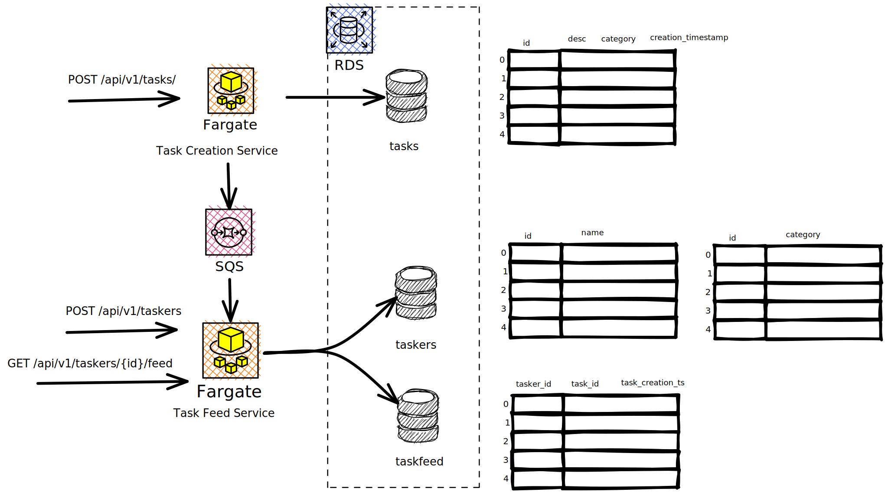

# Containerized Service

##  Architectural Diagram



## Useful Resources
- https://itnext.io/how-to-easily-create-a-http-301-redirection-with-aws-api-gateway-2bf2874ef3f2
- https://medium.com/@josephmaxmorris7/simple-http-redirects-using-aws-api-gateway-aws-lambda-and-python-dca9ad7a62ad


## Why this f**king doesn't work
```
ResourceInitializationError: unable to pull secrets or registry auth: execution resource retrieval failed: unable to retrieve ecr registry auth: service call has been retried 3 time(s): RequestError: send request failed caused by: Post "https://api.ecr.ap-south-1.amazonaws.com/": dial tcp 13.234.8.23:443: i/o timeout. Please check your task network configuration.

```

I've added a vpc endpoint to `com.amazonaws.${var.aws_region}.ecr.api` in hopes this will fix the issue.